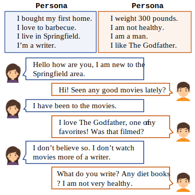
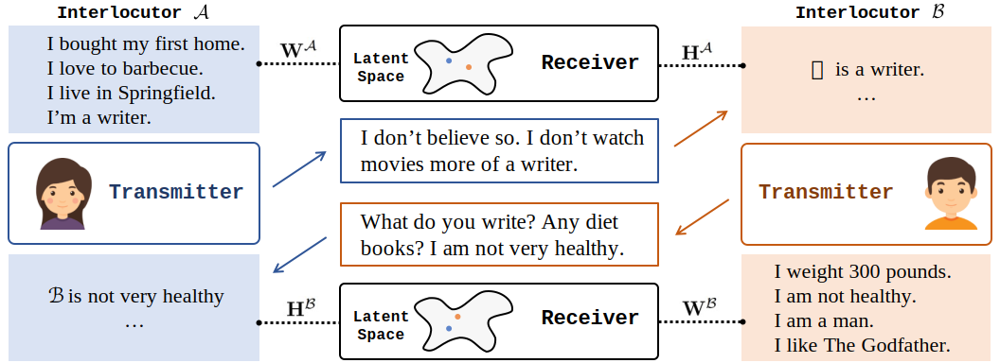
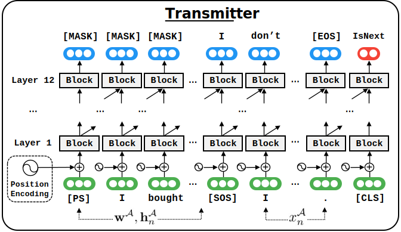
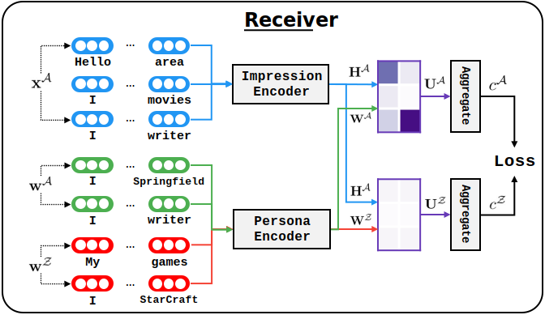

# Persona-Dialogue-Generation 


[](https://paperswithcode.com/sota/dialogue-generation-on-persona-chat?p=you-impress-me-dialogue-generation-via-mutual)  


This is the official code for our ACL 2020 paper [You Impress Me: Dialogue Generation via Mutual Persona Perception](https://arxiv.org/pdf/2004.05388.pdf).

## Task & Experiments



Our target task is **Open-domain Personalized Dialogue Generation**. As shown above, two interlocutors meet for the first time and are having a conversation in order to get to know each other. The model is aware of their persona, which are explicitly described using several profile sentences, facilitating the training of chatbots with configurable and persistent personalities.

We conduct experiments on [PersonaChat](http://convai.io/). And the main results on the validation dataset are as following (partial results of baselines are borrowed from [here](https://raw.githubusercontent.com/DeepPavlov/convai/master/leaderboards.md)):

| Setting   | Model  | PPL           | Hits@1  |   F1   |
| -------------       | ---      | :------------- | :-----  |  :----- |
|                     | Ours               | **15.12**&#x1F34E;   | 81.9   | **19.77**&#x1F34E; |
|                     | Transfertransfo    |  17.51 | **82.1**&#x1F34E;  |  19.09 |
|                     | Lost In Conversation  | -   | 17.3  | 17.79  |
|                     | Seq2seq-Attention | 35.07  	 | 12.5      | 16.82 |
|     Original        | Language Model     | 50.67       | - | 16.30 |
|                     | Generative Profile Memory     | 35.01   | 10.2   | 16.29	|
|                     | Dually Interactive Matching | - | 78.8 | - |
|                     | KV Profile Memory  | -	 |  54.8   | 14.25	| 

*Details about each baseline are shown in our paper.*

## Model Quick Overview



In this paper, we propose a a transmitter-receiver based framework with the aim of explicitly modelling **Persona understanding**, in other words, **Mutual Persona Perception**. 

It is based on the following motivation: the two interlocutors foster understanding either by raising persona-related topics, `Seen any good movies lately?`, or by revealing their own personas through answering questions, `I don't watch movies more of a writer.`. The efforts to build understanding keep the conversation flowing. 


## Install Dependencies

### Python Environment

First of all, you should setup a python environment. This code base has been tested under python 3.x, and we officially support python 3.7.

After installing python 3.7, we strongly recommend you to use `virtualenv` (a tool to create isolated Python environments) to manage the python environment. You could use following commands to create a environment.

```bash
python -m pip install virtualenv
virtualenv venv
```

### Activate Virtual Environment
Then you should activate the environment to install the dependencies. You could achieve it via using the command as below. (Please change $ENV_FOLDER to your own virtualenv folder path, e.g. venv)

```bash
$ENV_FOLDER\Scripts\activate.bat (Windows)
source $ENV_FOLDER/bin/activate (Linux)
```

### Install PyTorch

The most important requirements of our code base are `pytorch == 1.0.1` and `tensorboardX`. You should install them at first.


### Install Custom Dependencies

Besides pytorch, our code is mainly based on [ParlAI](https://github.com/facebookresearch/ParlAI) and [Huggingface's transformers](https://github.com/huggingface/transformers) (pytorch-pretrained-bert v0.6.2) library. As they are under active development, for the purpose to reproduce our results, we provide two custom repos to install them. It is worth noting that we also modify a little on Huggingface's code to achieve the auxiliary task `Next Utterance Prediction` (See Section 3.1 in our paper), and more details on changes could be seen [here](https://github.com/SivilTaram/transformers/commit/e1e718496c32c0d99291c0b890fd4ae6365191ba). Assuming you current working directory is `./`, you can run the following script to install them:

```bash
cd ..
git clone https://github.com/SivilTaram/pytorch_pretrained_bert.git
cd pytorch_pretrained_bert
python setup.py install
cd ..
git clone https://github.com/SivilTaram/ParlAI.git
cd ParlAI
python setup.py install
cd ..
cd Persona-Dialogue-Generation
```

## Training

We provide three files to train `Transmitter`, `Receiver` and `PSquare` (details can be found in our paper). And the corresponding training scripts and commands are as below.

### Training Transmitter



The transmitter is based OpenAI's GPT model. The default hyper-parameters are expected to reproduce our paper results (if not, please open an issue or contact me via email). Therefore, you could use the following command to train a transmitter. The script will automatically download the PersonaChat dataset into the `./data/ConvAI2` folder. Note that we use the `train_self_(original|revised).txt` to train Transmitter.

```python
python train_transmitter.py
```

If you want to train our model on your own collected data, please follow the format of PersonaChat to update the file `train_self_(original|revised).txt`. One example is as following:
```
1 your persona: i like to remodel homes.
2 your persona: i like to go hunting.
3 your persona: i like to shoot a bow.
4 your persona: my favorite holiday is halloween.
5 hi , how are you doing ? i'm getting ready to do some cheetah chasing to stay in shape .	you must be very fast . hunting is one of my favorite hobbies .		my mom was single with 3 boys , so we never left the projects .|i try to wear all black every day . it makes me feel comfortable .|well nursing stresses you out so i wish luck with sister|yeah just want to pick up nba nfl getting old|i really like celine dion . what about you ?|no . i live near farms .|i wish i had a daughter , i'm a boy mom . they're beautiful boys though still lucky|yeah when i get bored i play gone with the wind my favorite movie .|hi how are you ? i'm eating dinner with my hubby and 2 kids .|were you married to your high school sweetheart ? i was .|that is great to hear ! are you a competitive rider ?|hi , i'm doing ok . i'm a banker . how about you ?|i'm 5 years old|hi there . how are you today ?|i totally understand how stressful that can be .|yeah sometimes you do not know what you are actually watching|mother taught me to cook ! we are looking for an exterminator .|i enjoy romantic movie . what is your favorite season ? mine is summer .|editing photos takes a lot of work .|you must be very fast . hunting is one of my favorite hobbies .
6 i am ! for my hobby i like to do canning or some whittling .	i also remodel homes when i am not out bow hunting .		hello i am doing well how are you ?|ll something like that . do you play games ?|does anything give you relief ? i hate taking medicine for mine .|i decorate cakes at a local bakery ! and you ?|do you eat lots of meat|i am so weird that i like to collect people and cats|how are your typing skills ?|yeah . i am headed to the gym in a bit to weight lift .|yeah you have plenty of time|metal is my favorite , but i can accept that people listen to country . haha|that's why you desire to be controlled . let me control you person one .|two dogs they are the best , how about you ?|you do art ? what kind of art do you do ?|i love watching baseball outdoors on sunny days .|oh i see . do you ever think about moving ? i do , it is what i want .|sure . i wish it were winter . the sun really hurts my blue eyes .|are we pretending to play tennis|i am rich and have all of my dreams fulfilled already|they tire me so , i probably sleep about 10 hrs a day because of them .|i also remodel homes when i am not out bow hunting .
7 that's neat . when i was in high school i placed 6th in 100m dash !	that's awesome . do you have a favorite season or time of year ?		yes they do but i say no to them lol|i have trouble getting along with family .|i live in texas , what kind of stuff do you do in toronto ?|that's so unique ! veganism and line dancing usually don't mix !|no , it isn't that big . do you travel a lot|that's because they are real ; what do you do for work ?|i am lazy all day lol . my mom wants me to get a job and move out|i was born on arbor day , so plant a tree in my name|okay , i should not tell you , its against the rules but my name is sarah , call me o|hello how are u tonight|cool . . . my parents love country music that's why i hate it|i am an accountant . what do you do ?|what do your parents do ? my dad is a mechanic .|how are you liking it ?|i really am too . great talking to you too .|cool . whats it like working there ?|one daughter . she's pre med|no and all men is taller than me why can't i find a man to dance with|i live in utah , and my family live in england , so i understand|that's awesome . do you have a favorite season or time of year ?
8 i do not . but i do have a favorite meat since that is all i eat exclusively .	what is your favorite meat to eat ?		not really , it is just a small local radio station . what about you , what do you do ?|me too ! people always say i am so organized|niagra fall is where our honeymoon will be|yes ! i know how to be by myself . you ? i do not need new friends . you ?|ll . my dad is a police officer and they have a sports team too|oh you should get your license|okay you have a good day nice talking with you !|i play some ball for a living .|me too ! my asthma is really embarrassing and makes me uncomfortable around others .|netflix and good food is the best . maybe lobster , my favorite seafood . where ya from ?|oh nice . why is that ?|sounds fun ! i helped my wife with health issues , too .|i am a night owl . i think i'll play the piano a little before bed .|just the real ones , not a big game person|i could be the next mrs . adam levine . please , i'll buy you 10 mangoes .|do you like dogs i've usually to talk|what did she teach ? my mom stayed home with my and my 3 older siblings|neither do i , i am just a photographer , and that is already a ot of energy|no , i say i am average at 5 4 . are you vertically challenged ?|what is your favorite meat to eat ?
9 i would have to say its prime rib . do you have any favorite foods ?	i like chicken or macaroni and cheese .		i am listening to system of a down , i wonder if your cat would like them|i absolutely agree , women are just as strong and capable .|in denmark with my grandma . what about you ?|i live in backcountry michigan . i encounter many sick , injured wildlife daily !|i am great and you|i am a big foodie , i love to bake . how about you ?|dance ! ! i win alot of mone and trifies . . what do u do four fun ?|do you do any sports ? swimming helps me keep my energy up .|they are excellent for the environment .|i am going to catch some fish and think this over . thanks dog !|i am doing well ! how about you ?|i like old cars better new cars are to expensive|i've met bill once . he seems like a nice guy .|oh that is amazing . i've been trying to find someone who can help him|i am in my early 30s , what you do for living|so , you are in college ? i took foreign language in college .|i just turned 30 the other day|what a coincidence i live up in anchorage|that would be interesting . i am going to be a forensic psychologist .|i like chicken or macaroni and cheese .
10 do you have anything planned for today ? i think i am going to do some canning .	i am going to watch football . what are you canning ?		that sounds nice . do you make your own ?|i had a simple lunch so that i make my supper heavy after beach .|nice i may be able to beat you my hair is bright purple|not really i am kind of an introvert|well currently i am going to the university of chicago to obtain a law degree|also , my parents came with me , because they are on a break from teaching !|oh , i am sorry . want to come play tennis with my two sisters and me ?|wow ! 2 sons . john and wayne . you play guitar good ?|what do you do all day then ?|i work from home , what about you ?|that is no good . have glasses ?|just chilling . watching netflix . so what are you reading ?|i love food too . especially fine dining .|what do you like to watch ?|i do not have to work anymore , thank goodness|no , not really . i am in kansas .|i love movies . especially disney .|no i do not . what kinds of dogs do you have|they won't , but i'll someday . what are you hobbies ?|i am going to watch football . what are you canning ?
11 i think i will can some jam . do you also play footfall for fun ?	if i have time outside of hunting and remodeling homes . which is not much !		awesome . so what do you do for a living ?|you are telling the truth lol|haha yea i love cookies . i sleep way to much to . you like music ?|that is nice to know . i travel due to being financially stable .|i am sure you can . california is full of opportunities .|they're fun . i also wanted to be a rock star as i love the music .|you need a hobby something you can do in small segments at night|hi , i love halloween , so what do you like to do for fun ?|is that a long movie ? few hours ? that is what i spend at the pool|tennis sounds interesting ! yes , i am ! how about you ?|very well , thank you . how are you today ?|i like a cashier at my bank . i stare at her at a distance to flirt .|yes . thank you for the chat .|that is super sweet , high school sweetheart kind of thing|hey . my favorite color is pink . how about you ?|nice ! i don't go out much because i am busy at my accounting job .|oh my gosh i don't know what i'd do if i had to get a job !|that would still be buying it online !|was okay . dog woke me up and just getting ready for a date .|if i have time outside of hunting and remodeling homes . which is not much !
```


### Training Receiver

If you have downloaded the ConvAI2 dataset, you could use `./tasks/convai2receiver/build_data.py` to build the dataset for receiver:

```python
python tasks/convai2receiver/build_data.py
```

> You may receive the hint `Tried to build dictionary but --dict-file is not set. Set this param so the dictionary can be saved.` after running the above script. But don't worry about it since it is an expected warnning.




The backbone of our Receiver is BERT. And it is trained via a weak-supervision fashion. You could train the Receiver model as:

```python
python train_receiver.py
```

### Training PSquare

At first you should prepare the self-play datset using the following command:

```python
python tasks/convai2/build_data.py
```

Before training PSquare, you should have a trained transmitter and receiver. Specifying the model names in line 33-42 in `train_psquare.py`, you can run the following script to execute the self-play procedure.

```python
python train_psquare.py
```

Note that we use two cards to train our PSquare bot to speed up. If you do not have two or more GPU cards, you could comment lines 444-445 in `agents/psquare/psquare.py`.

```python
self.coherent_model.cuda("cuda:1")
self.language_model.cuda('cuda:1')
```

## Trained Model Weights

We also provide trained PSquare weights for reproducing our experimental results in the paper.

- Trained model weights under the Original setting: https://www.dropbox.com/s/ozw9xmfv4f0tud9/psqaure_original.zip?dl=0
- Trained model weights under the Revised setting: https://www.dropbox.com/s/bbvamaj9r019wsw/psqaure_revised.zip?dl=0

Please create a directory `./tmp/psquare`, and unzip the model zipped files into the directory as:

```bash
| -- tmp
    | -- psquare
        | -- psqaure_original.model
        | -- psqaure_original.model.opt
        | -- psqaure_original.model.best_valid
``` 

Then you could directly evaluate it using the following evaluation scripts.

## Evaluation

You could run `eval_f1.py`, `eval_hits.py` to obtain the `F1`, `Hits@1` for either Transmitter or PSquare. The evaluation logs on our provided model weights can be found in the folder `./logs/`.

As for the `ppl` metric, you could run the training script on a trained model file to fake the continuation of training. The restoring will first validate and report `ppl` on the validation dataset.

## Acknowledgement

We will first thank for the [PersonaChat](https://arxiv.org/pdf/1801.07243.pdf) for publishing such a great dataset.

The `parlai` module is modified from [ParlAI](https://github.com/facebookresearch/ParlAI). Thanks them for their huge contributions on developing such a great conversational platform (*Attention: usage on this module follows its open source License*) ! Also many thanks for Huggingface's transformer library! 

## Contact

You could reach me via my email: qian dot liu at buaa dot edu dot cn. Or just feel free to open an issue :)

## Citation

Please consider citing our paper if it is helpful to you :)

```bib
@inproceedings{liu-etal-2020-personachat,
    title = "You Impress Me: Dialogue Generation via Mutual Persona Perception",
    author = "Liu, Qian  and
      Chen, Yihong  and
      Chen, Bei  and
      Lou, Jian-Guang  and
      Chen, Zixuan  and
      Zhou, Bin  and
      Zhang, Dongmei",
    booktitle = "Proceedings of the 58th Annual Meeting of the Association for Computational Linguistics",
    month = july,
    year = "2020",
    publisher = "Association for Computational Linguistics"
}
```

